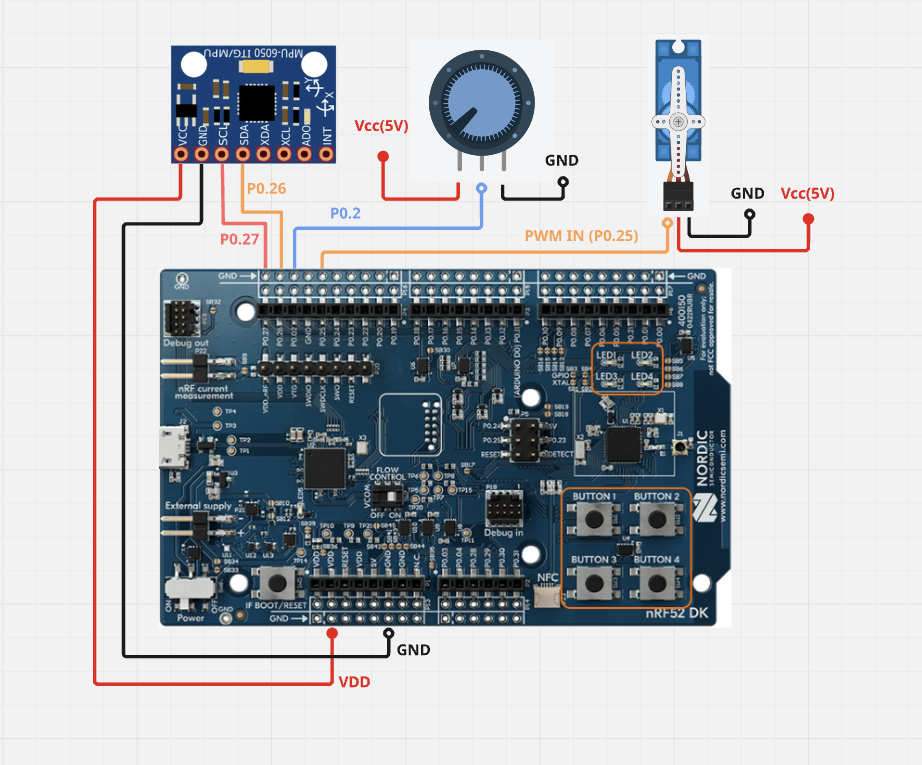

# ble_basics_app_nrf52SDK17

# nRF52 BLE Firmware Examples

  

BLE firmware examples for the **nRF52832 Dev Kit** using **Nordic SDK 17.0.1**.  
Designed for learning BLE protocols, peripheral control, and DFU updates.

---

## Table of Contents
- [Features](#features)
- [BLE Profile](#ble-profile)
- [Peripherals](#peripherals)
- [Configuration](#configuration)
- [Hardware & Wiring](#hardware--wiring)
- [Installation & Build](#installation--build)
- [DFU (Firmware Update)](#dfu-firmware-update)
- [License](#license)

---

## Features
- LED toggle & dimming
- Four on-board button press detection
- PWM-driven servo motor control
- ADC reading (Potentiometer)
- MPU6050 sensor via TWIM/I2C
- DFU firmware update support
- Modular configuration via `app_config.h`

---

## BLE Profile

### First Service

| Characteristic | Function | Command / Value |
|----------------|---------|----------------|
| LED Toggle | Toggle on-board LEDs | `0x00` – `0x03` |
| Button Press Detection | Reports pressed button | Button 1 → `0x01`, Button 2 → `0x02`, Button 3 → `0x03`, Button 4 → `0x04` |
| PWM/Servo Control | LED dimming & servo motion | Input `0–255` (LED brightness + servo pulse 1ms–2ms → 0–180°) |

### Second Service

| Characteristic | Function | Update Interval |
|----------------|---------|----------------|
| ADC Value | Reports potentiometer reading | Every 1.5 sec |
| MPU6050 Sensor | Reports sensor data via TWIM/I2C | Every 1.5 sec |

### Third Service (DFU)

| Characteristic | Function |
|----------------|---------|
| DFU Trigger | Upload new firmware by writing `0x01` or triggering DFU mode |

<p align="center" width="100%">

</p>
*Figure 1: Workflow showing BLE services, peripheral interaction, and DFU update.*

---

## Peripherals
- LED toggle (ON/OFF)
- LED dimming (PWM)
- Servo motor control (PWM)
- Button press detection (4 buttons)
- ADC (Potentiometer)
- MPU6050 sensor via TWIM/I2C
- DFU firmware upload

---

## Configuration
- `app_config.h` defines all peripherals, protocols, and features used in this example.
- Macros control feature inclusion during compilation:
  - `1` → feature enabled  
  - `0` → feature disabled
- SDK uses this file to configure peripherals and include required code blocks.

---

## Hardware & Wiring



*Figure 2: Wiring layout for the NRF52 dev kit and peripherals.*

---

## Installation & Build

1. **Clone the repository:**
```bash
git clone https://github.com/wisalmuhammad/ble_basics_app_nrf52SDK17.git
cd project-name 
```


2. **Open in Segger Embedded Studio (SES)**
  - Ensure app_config.h macros match your desired feature set.

3. **Build & Flash**
- Compile in SES.
- Flash firmware to nRF52832 Dev Kit via SEGGER J-Link.

### DFU (Firmware Update)
- Trigger DFU mode via third BLE service by writing 0x01 or using dev kit’s DFU method.
- Use nRF Connect app or nrfutil to upload new firmware over BLE.

---

## License
This project is licensed under the MIT License - see the [LICENSE](LICENSE.txt) file for details.